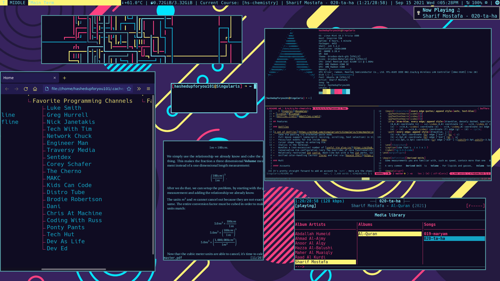

  <h1>
       
        <a href="https://damrah.netlify.app"> My Website </a> - <a href="https://damrah.netlify.app/about/"> My Resumé </a>
      
  </h1>

  
    

  <h1>
       
        <a href="https://www.quora.com/profile/SingularisArt?q=SingularisArt">Quora</a> - <a href="https://stackoverflow.com/users/16841521/hashem-a-damrah">Stack Overflow</a> - <a href="https://www.reddit.com/user/Desperate_Party_9259">Reddit</a>
      
  </h1>

<!-- BLOG-POST-LIST:START -->
- [How I'm able to take notes with LaTeX in mathematics class](https://damrah.netlify.app/post/how-im-able-to-take-notes-with-latex-in-mathematics-class/)
<!-- BLOG-POST-LIST:END -->

  </a>

- 🔭 I'm currently working on:
  - My [Dotfiles](https://github.com/SingularisArt/Singularis)
  - My [NeoVim Config](https://github.com/SingularisArt/Death.NeoVim)
  - My [Website](https://damrah.netlify.app)

- 🌱 I'm currently learning a ton of different things. They are:
  - Learning new human languages (Spanish, Greek, Latin)
  - Learning new computer languages (C#, MongoDB, TS, Docker, Java, Rust, Ruby, Php)
  - Blockchain
  - My [Website](https://damrah.netlify.app)

- 📫 How to reach me:
  - 📧 Email me (dermdorm2@gmail.com)
  - Contact me through my [website](https://damrah.netlify.app/contact/)

- 🗒️ Updates and Notes
  - Just published my [Website](https://damrah.netlify.app) 
(September 5, 2021 (05:09 AM)

  - Updated my README.md 
(September 15, 2021 (05:40 PM)

